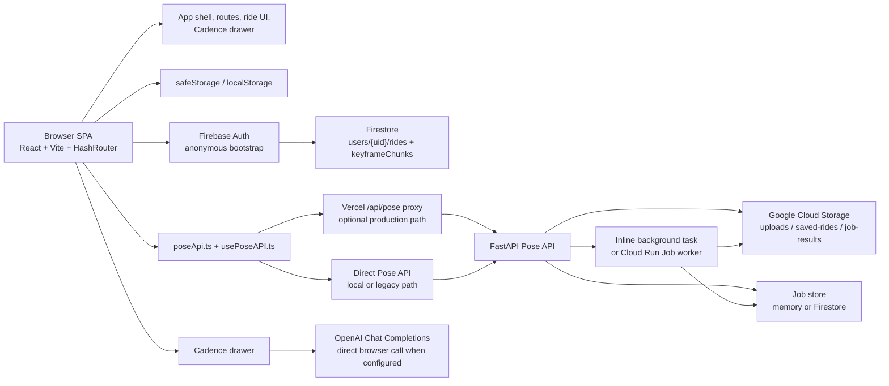

# Horsera Current App Architecture

This document describes the **implemented architecture in the repository today**. It is written for engineers and data scientists who need to understand how the app actually runs end-to-end: frontend structure, backend services, storage surfaces, request flows, and the main technical risks.

This document **complements** the conceptual progression-model architecture in [_product-docs/🐴 Horsera Architecture 🚀🤩💖.txt](../_product-docs/%F0%9F%90%B4%20Horsera%20Architecture%20%F0%9F%9A%80%F0%9F%A4%A9%F0%9F%92%96.txt). It does **not** replace it. The conceptual document explains the intended rider-development model; this document explains the current operational system implemented in code.

## Supporting References

- Conceptual progression model: [_product-docs/🐴 Horsera Architecture 🚀🤩💖.txt](../_product-docs/%F0%9F%90%B4%20Horsera%20Architecture%20%F0%9F%9A%80%F0%9F%A4%A9%F0%9F%92%96.txt)
- Vercel to Cloud Run proxy design: [docs/vercel-pose-proxy.md](./vercel-pose-proxy.md)
- Pose API production handoff and incident notes: [pose_api/ENGINEER_HANDOFF.md](../pose_api/ENGINEER_HANDOFF.md)

## Purpose And Scope

Horsera is currently a **single-page web app** with:

- a React/Vite frontend that handles routing, onboarding, ride upload, playback, progress, and the Cadence assistant
- a Firebase-backed ride store with local cache fallback
- a Python pose-analysis service that handles video jobs and keypoint extraction
- Google Cloud Storage for uploaded and saved ride videos
- an optional authenticated Vercel proxy in front of the pose service

The architecture is a hybrid of:

- productionized ride-analysis infrastructure
- lightweight client-side state and persistence patterns
- some still-evolving product surfaces that use heuristics or mock data

The result is a system where the **video-analysis loop is real**, but the higher-level progression model described in product docs is only partially represented in the shipped runtime and data model.

## Stack And Deployment Snapshot

### Frontend

The frontend is a Vite + React + TypeScript SPA with Tailwind/shadcn dependencies declared in [package.json](../package.json). The root boot sequence lives in:

- [src/main.tsx](../src/main.tsx)
- [src/App.tsx](../src/App.tsx)
- [src/components/layout/AppShell.tsx](../src/components/layout/AppShell.tsx)

Notable runtime choices:

- Routing uses `HashRouter`, not browser-history routing.
- `QueryClientProvider` is present, but most app state is still managed through custom hooks, local state, and direct store helpers rather than React Query-backed API orchestration.
- Capacitor is configured in [capacitor.config.ts](../capacitor.config.ts), but the app currently behaves primarily like a PWA/web app.

### Services And Infrastructure

The app currently spans these external systems:

- Firebase Auth for anonymous identity bootstrap: [src/integrations/firebase/client.ts](../src/integrations/firebase/client.ts)
- Firestore for ride metadata and chunked keyframe storage: [src/lib/storage.ts](../src/lib/storage.ts)
- Google Cloud Storage for uploaded videos, pinned saved videos, and optionally compressed job results: [pose_api/main.py](../pose_api/main.py)
- FastAPI pose service for signed URLs, job creation, polling, and frame/video analysis: [pose_api/main.py](../pose_api/main.py)
- Cloud Run Jobs worker path for out-of-process video analysis: [pose_api/worker.py](../pose_api/worker.py)
- Optional Vercel proxy for authenticated same-origin browser access to the pose service: [api/pose.js](../api/pose.js)

### AI Surface

Cadence is currently implemented as a **client-side drawer** in [src/components/layout/CadenceDrawer.tsx](../src/components/layout/CadenceDrawer.tsx). When `VITE_OPENAI_API_KEY` is present, the browser calls OpenAI directly. When it is absent, the UI falls back to canned or heuristic responses.

That means the current AI surface is:

- not mediated by a server-owned app backend
- not strongly isolated from browser/runtime concerns
- only loosely coupled to the persisted rider record

## System Topology



## Frontend Architecture

### Root Composition

The root app boot is intentionally simple:

- [src/main.tsx](../src/main.tsx) mounts the React tree.
- [src/App.tsx](../src/App.tsx) wraps the app in `QueryClientProvider`, `TooltipProvider`, toasters, and `HashRouter`.
- `AppBootstrap` calls `initializeRideStore()` once on startup.
- [src/components/layout/AppShell.tsx](../src/components/layout/AppShell.tsx) provides the fixed shell: header, onboarding gate, profile/settings panel, bottom nav, and Cadence FAB.
- [src/context/CadenceContext.tsx](../src/context/CadenceContext.tsx) controls the Cadence drawer open/streaming/speech state.

### Route Structure

The route table in [src/App.tsx](../src/App.tsx) defines the current navigation model:

| Route | Purpose | Notes |
| --- | --- | --- |
| `/#/` | Rides list and upload flow | Primary landing page and main entry to analysis |
| `/#/rides/:id` | Ride detail and playback | Hydrates keyframes, resolves playback URLs, supports video replacement |
| `/#/jobs/:jobId/view` | Recovery/debug viewer | Polls a job until complete and then loads overlay playback |
| `/#/progress` | Insights/progress screen | Promoted to main nav |
| `/#/journey` | Progression/journey screen | Still partly heuristic and discipline-limited |
| `/#/analysis` | Analysis sandbox | Kept URL-accessible but removed from main navigation |

### Main Frontend Modules

The important frontend responsibilities are split across a few modules:

- [src/pages/RidesPage.tsx](../src/pages/RidesPage.tsx): file selection, validation, analysis kickoff, save flow
- [src/hooks/usePoseAPI.ts](../src/hooks/usePoseAPI.ts): upload orchestration, progress state, polling, result mapping
- [src/pages/RideDetailPage2.tsx](../src/pages/RideDetailPage2.tsx): ride hydration, playback URL refresh, ride editing/replacement
- [src/pages/JobOverlayViewerPage.tsx](../src/pages/JobOverlayViewerPage.tsx): recovery path for long-running jobs
- [src/pages/analysis/InsightsTab.tsx](../src/pages/analysis/InsightsTab.tsx): score history and metric surfaces
- [src/pages/JourneyPage.tsx](../src/pages/JourneyPage.tsx): level/test progression view driven partly by heuristics and static level definitions
- [src/components/layout/CadenceDrawer.tsx](../src/components/layout/CadenceDrawer.tsx): AI chat UI and direct model call path

### Client-Side State Sources

The app uses multiple client-side state layers at once:

| State Source | Where | What It Holds |
| --- | --- | --- |
| React component state | across pages/components | transient UI state, upload progress, drawers, forms |
| Context | [src/context/CadenceContext.tsx](../src/context/CadenceContext.tsx) | Cadence open/streaming/speech state |
| `safeStorage` wrapper | [src/lib/safeStorage.ts](../src/lib/safeStorage.ts) | localStorage with in-memory fallback |
| Firebase-backed ride store | [src/lib/storage.ts](../src/lib/storage.ts) | canonical ride metadata, cached client-side |
| Mock data | [src/data/mock.ts](../src/data/mock.ts) and consumers | fallback or placeholder content for some product surfaces |

`safeStorage` exists so the app can continue working when browser storage is unavailable. It is used for:

- rider profile
- cached ride list
- migration/cutover markers
- Cadence conversation history
- profile photo
- older video-analysis helper storage

### Analysis Hooks: Current Versus Older Path

There are two analysis-oriented client hooks in the repo:

- [src/hooks/usePoseAPI.ts](../src/hooks/usePoseAPI.ts): the current networked path used by the main ride flow
- [src/hooks/useVideoAnalysis.ts](../src/hooks/useVideoAnalysis.ts): an older/local browser-analysis path using MoveNet/TF.js

Today, `usePoseAPI` is the operational path for the ride-analysis loop. It:

1. creates a local blob URL for immediate playback UX
2. keeps the original selected video as the upload payload; an older client-compression helper remains in code but is not the active path
3. requests a signed upload URL
4. uploads directly to cloud storage
5. submits a job from the uploaded object path
6. polls job status
7. maps returned keypoints into frontend playback structures

`useVideoAnalysis` remains in the codebase as an older or fallback-oriented path. It dynamically loads TF.js and MoveNet in-browser and can produce local demo or local analysis output, but it is not the main path wired into the primary upload flow.

## Backend And Service Architecture

### Pose API Responsibilities

The FastAPI service in [pose_api/main.py](../pose_api/main.py) is the core analysis backend. It currently owns:

- `POST /uploads/video-url`: mint signed GCS upload URLs
- `POST /videos/pin`: copy uploaded objects into a durable saved-rides prefix
- `POST /videos/read-url`: mint signed playback URLs for stored videos
- `POST /analyze/video/object`: create a job from an already-uploaded GCS object
- `POST /analyze/video`: legacy multipart upload path
- `GET /jobs/{job_id}`: polling endpoint for job state and results
- `POST /analyze/frame`: synchronous single-frame analysis

These responsibilities combine what many systems would split into separate services:

- upload orchestration
- job queueing
- job status persistence
- model execution
- result packaging
- storage URL minting

### Vercel Proxy Layer

[api/pose.js](../api/pose.js) is an authenticated proxy layer intended for production deployments where the browser should talk to a same-origin endpoint and the Cloud Run service remains authenticated.

The proxy:

- accepts browser requests on `/api/pose/...`
- mints an identity token using Vercel OIDC and Google auth flows
- forwards the request upstream to the pose service
- preserves relevant response headers
- handles CORS at the proxy edge for allowed origins

This proxy is especially important because the frontend defaults to:

- `http://localhost:8000` on local localhost development
- `/api/pose` in non-local environments

See [src/lib/poseApi.ts](../src/lib/poseApi.ts) and [docs/vercel-pose-proxy.md](./vercel-pose-proxy.md).

### Execution Modes In The Python Service

The pose service supports more than one execution model.

#### 1. Inline/background task mode

In this mode the API process itself:

- receives the request
- creates the job record
- starts background processing through FastAPI background tasks
- updates in-memory or Firestore-backed status itself

This is simpler, but it couples job execution to the API container lifecycle and memory profile.

#### 2. Cloud Run Job worker mode

In this mode the API process:

- creates the job record
- dispatches a Cloud Run Job based on size threshold and configured CPU/GPU workers
- relies on shared persisted job state for polling

The worker entrypoint lives in [pose_api/worker.py](../pose_api/worker.py). It forces persisted job state defaults so the browser does not poll forever on stale documents.

### Pose Analysis Pipeline

The main video pipeline in [pose_api/pipeline.py](../pose_api/pipeline.py) is roughly:

1. inspect video metadata and derive a sampling cadence
2. decode frames progressively without buffering the full video
3. detect horse regions
4. run rider pose inference, including smart cropping and reacquisition logic
5. normalize keypoints to 0 to 1 coordinates for frontend playback
6. derive biomechanics scores
7. derive riding-quality scores from biomechanics
8. package frame-level and aggregate outputs into a `PipelineResult`

The pipeline also tracks:

- sampled frame counts
- detection rate
- APS and CAE-related metrics
- per-frame keypoints and timestamps
- progress payloads for the polling UI

### Result Persistence Strategy

The backend uses a mixed result-persistence approach:

- job metadata can live in memory or Firestore
- full result payloads can be stored inline with the job record or offloaded to GCS
- when full results are stored in GCS, polling can hydrate them back into the returned response on demand

That split exists to make large result payloads more manageable, especially when frame arrays are large.

## Ride Analysis And Persistence Flow

```mermaid
sequenceDiagram
  participant Rider as Browser SPA
  participant Pose as Pose API or /api/pose proxy
  participant GCS as Google Cloud Storage
  participant Jobs as Job store (memory or Firestore)
  participant Worker as Inline worker or Cloud Run Job
  participant Rides as Firestore ride store

  Rider->>Pose: POST /uploads/video-url
  Pose-->>Rider: signed upload URL + object_path
  Rider->>GCS: PUT video bytes directly to signed URL
  Note over Rider: usePoseAPI currently uploads the original file; Cloud Run handles decode/analysis

  Rider->>Pose: POST /analyze/video/object (object_path, filename, size_mb)
  Pose->>Jobs: create pending job
  Pose->>Worker: start inline work or dispatch Cloud Run Job
  Pose-->>Rider: job_id

  loop poll until complete or failed
    Rider->>Pose: GET /jobs/{job_id}
    Pose->>Jobs: read current status
    Worker->>Jobs: update progress and final status
    Worker->>GCS: optionally read source object and write result payload
    Pose-->>Rider: pending / processing / complete / failed
  end

  Rider->>Pose: POST /videos/pin
  Pose->>GCS: copy upload object into saved-rides prefix
  Pose-->>Rider: pinned object_path

  Rider->>Pose: POST /videos/read-url
  Pose-->>Rider: signed playback URL

  Rider->>Rides: save StoredRide metadata + keyframe chunks
  Note over Rides: users/{uid}/rides/{rideId}<br/>keyframeChunks subcollection

  Note over Rider,Rides: Later ride-detail loads may hydrate keyframes lazily
  Rider->>Rides: read ride metadata and keyframe chunks
  Rider->>Pose: POST /videos/read-url to refresh expiring playback URL
```

### Save Flow Versus Analysis Flow

A subtle but important detail in the frontend is that **analysis** and **ride persistence** are not the same transaction.

The main UX path is:

- analyze first
- save later when the rider confirms the session

That means the app can have:

- analyzed but unsaved ride data living in browser memory
- uploaded but not yet pinned cloud objects
- saved rides whose keyframes are chunked and stored in Firestore
- playback URLs that must be rehydrated because signed URLs expire

## Data Model And Storage Surfaces

### Storage Map

| Surface | Location | Purpose |
| --- | --- | --- |
| Browser local cache | [src/lib/safeStorage.ts](../src/lib/safeStorage.ts) | localStorage with in-memory fallback |
| Rider profile | `horsera_user_profile` via [src/lib/userProfile.ts](../src/lib/userProfile.ts) | onboarding/profile data |
| Cached ride list | `horsera_rides` via [src/lib/storage.ts](../src/lib/storage.ts) | local ride cache without full keyframes |
| Firestore cutover marker | `horsera_firestore_cutover_v1` | one-time migration/backfill marker |
| Cadence history | `horsera_cadence_history` | persisted chat transcript |
| Profile photo | `horsera_profile_photo` | avatar image data URL |
| Older video-analysis stores | [src/lib/videoAnalysis.ts](../src/lib/videoAnalysis.ts) keys | auxiliary legacy/local analysis state |
| Firestore ride record | `users/{uid}/rides/{rideId}` | canonical saved ride metadata |
| Firestore keyframe chunks | `users/{uid}/rides/{rideId}/keyframeChunks` | chunked keypoint frames |
| GCS upload objects | `uploads/...` | transient uploaded videos |
| GCS saved ride objects | `saved-rides/...` | durable pinned ride videos |
| GCS result payloads | `job-results/...` | externally stored full job payloads |
| Pose job state | memory or Firestore `pose_jobs` | analysis job lifecycle state |

### Firestore Ride Shape

The core persisted frontend shape is `StoredRide` in [src/lib/storage.ts](../src/lib/storage.ts). It contains:

- ride identity and metadata: `id`, `date`, `horse`, `type`, `duration`
- video fields: `videoFileName`, `videoUrl`, `videoObjectPath`, `poseJobId`
- biomechanical aggregates
- riding-quality aggregates
- overall score and insight strings
- optional keyframes
- optional `name` and `notes`
- schema version

Keyframes are intentionally chunked into groups of 100 frames before being written to Firestore. That reduces document size pressure and allows lazy hydration later through `hydrateRide()`.

### Pose Job Response Shape

The pose job payload returned through polling is effectively:

- job metadata: `job_id`, `status`, `stage`, timestamps, error
- optional progress metadata while processing
- optional result payload when complete

The result payload includes, at minimum:

- biomechanics
- riding-quality metrics
- overall score
- detection-related metadata
- insight strings
- `framesData` with per-frame timestamps and normalized keypoints

### Where Metrics Are Produced

Metrics are produced in two main layers:

- backend production path: [pose_api/pipeline.py](../pose_api/pipeline.py)
- older/local browser-analysis path: [src/hooks/useVideoAnalysis.ts](../src/hooks/useVideoAnalysis.ts) plus [src/lib/poseAnalysis.ts](../src/lib/poseAnalysis.ts)

The backend path is the one that matters for the current ride-analysis loop. It produces:

- normalized rider keypoints
- biomechanics scores such as lower leg stability and rein steadiness
- derived riding-quality metrics such as rhythm and balance

### Where Metrics Are Consumed

The frontend consumes those metrics in several places:

- saved ride summaries and save flow in [src/pages/RidesPage.tsx](../src/pages/RidesPage.tsx)
- overlay playback and detail views in [src/pages/RideDetailPage2.tsx](../src/pages/RideDetailPage2.tsx)
- progress charts in [src/pages/analysis/InsightsTab.tsx](../src/pages/analysis/InsightsTab.tsx)
- heuristic movement readiness in [src/pages/JourneyPage.tsx](../src/pages/JourneyPage.tsx)
- AI prompt context in [src/components/layout/CadenceDrawer.tsx](../src/components/layout/CadenceDrawer.tsx)

## Outstanding Technical Issues

This section focuses on issues that are visible in the codebase and supporting engineering docs, not on the full product backlog.

### 1. Reliability And Backend Operations

#### Production pose-analysis stability remains fragile

**What it is**

The strongest documented operational risk is the production pose-analysis path crashing during video processing, especially around memory pressure and worker lifecycle behavior.

**Why it matters**

This is the core activation loop of the app. If upload succeeds but polling later fails, the app loses trust at the exact moment a rider expects the main product value.

**Current evidence**

- [pose_api/ENGINEER_HANDOFF.md](../pose_api/ENGINEER_HANDOFF.md) summarizes the current Cloud Run-oriented handoff and the historical Railway/OOM lessons that shaped it.
- [pose_api/main.py](../pose_api/main.py) contains explicit stale-job handling, eager model preload logic, and multiple fallback code paths shaped by this risk.

**Operational impact**

- jobs may fail after upload succeeds
- browser polling can degrade into confusing retry behavior
- debugging becomes harder because failures may be infrastructure- or memory-driven rather than clean application exceptions

#### Execution backend complexity has grown

**What it is**

The pose service now supports multiple execution and persistence combinations:

- inline vs Cloud Run Job execution
- memory vs Firestore job store
- inline vs GCS-backed result payloads

**Why it matters**

Each additional mode increases branching behavior, deployment surface area, and failure combinations.

**Current evidence**

- [pose_api/main.py](../pose_api/main.py) contains configuration branches for `EXECUTION_BACKEND`, `JOB_STORE_BACKEND`, result hydration, stale-job conversion, and GPU routing.
- [pose_api/worker.py](../pose_api/worker.py) exists specifically to enforce job-store behavior in worker executions.

**Operational impact**

- harder test matrix
- more environment variables to keep aligned
- easier to create configuration drift between local, legacy Railway/Render files, Vercel proxy, and Cloud Run deployments

### 2. Security And Architecture Boundaries

#### Cadence currently exposes a browser-side AI integration

**What it is**

Cadence calls OpenAI directly from the browser when `VITE_OPENAI_API_KEY` is configured.

**Why it matters**

This couples model access, prompt behavior, and provider interaction to the client runtime rather than a controlled backend boundary.

**Current evidence**

- [src/components/layout/CadenceDrawer.tsx](../src/components/layout/CadenceDrawer.tsx) reads `VITE_OPENAI_API_KEY` and sends browser fetch requests directly to `https://api.openai.com/v1/chat/completions`.

**Operational or product impact**

- weaker control over security and policy boundaries
- harder central logging and observability
- harder to guarantee stable prompt contracts or model migrations without a frontend deployment

#### Browser-facing coupling to third-party endpoints is uneven

**What it is**

The pose service is partially abstracted behind the Vercel proxy, but Cadence is not. The app therefore has inconsistent backend boundaries:

- ride analysis may go through `/api/pose`
- Cadence may talk directly to OpenAI

**Why it matters**

The app has two different patterns for external service access, which complicates reasoning about auth, telemetry, and failure handling.

**Current evidence**

- [src/lib/poseApi.ts](../src/lib/poseApi.ts) defaults to `/api/pose` outside localhost
- [api/pose.js](../api/pose.js) implements a dedicated authenticated proxy
- [src/components/layout/CadenceDrawer.tsx](../src/components/layout/CadenceDrawer.tsx) bypasses that pattern entirely for AI

**Operational or product impact**

- inconsistent security posture
- inconsistent rate-limit and error handling story
- harder to unify cost control and logging across external integrations

### 3. Data Consistency And Architecture Drift

#### The app currently spans several overlapping state systems

**What it is**

The shipped app uses:

- React local state
- `safeStorage` local persistence
- Firebase/Firestore ride persistence
- GCS object storage
- pose job state in memory or Firestore
- mock or placeholder data in some UI surfaces

**Why it matters**

There is no single state boundary for "truth" across the product. Different screens may resolve information from different systems at different times.

**Current evidence**

- [src/lib/storage.ts](../src/lib/storage.ts) caches locally, backfills remotely, chunks keyframes, and refreshes signed URLs
- [src/lib/videoAnalysis.ts](../src/lib/videoAnalysis.ts) maintains additional local-only analysis storage
- [src/pages/analysis/InsightsTab.tsx](../src/pages/analysis/InsightsTab.tsx) includes mock fallback data
- [src/pages/JourneyPage.tsx](../src/pages/JourneyPage.tsx) mixes stored rides with static level definitions and inferred level logic

**Operational or product impact**

- harder debugging when a user reports mismatch between screens
- more opportunities for stale data or partially migrated state
- more complex reasoning for future analytics pipelines

#### Some product surfaces still mix real and placeholder logic

**What it is**

Not every screen is driven by the same persisted model. Some features still infer, mock, or hardcode parts of the experience.

**Why it matters**

This creates a gap between what the product appears to promise and what the current data model actually guarantees.

**Current evidence**

- [src/pages/JourneyPage.tsx](../src/pages/JourneyPage.tsx) hardcodes level data and Intro A movements, and infers current level from recent ride scores.
- [src/pages/analysis/InsightsTab.tsx](../src/pages/analysis/InsightsTab.tsx) ships mock fallback metric data and score history.
- [src/components/layout/CadenceDrawer.tsx](../src/components/layout/CadenceDrawer.tsx) still falls back to mock rides and mock goal context if persisted rides are absent.

**Operational or product impact**

- analytics readers may overestimate model maturity
- product behavior can differ by whether a user has persisted rides yet
- harder to build a clean downstream schema from UI assumptions

### 4. Product Versus Runtime Architecture Drift

#### The conceptual progression model is ahead of the shipped runtime

**What it is**

The product docs describe a rich model with RiderBiomechanics, RidingQuality, Tasks, Levels, mappings, evidence, and derived assessments. The implemented app currently persists mostly ride-centric session summaries and frame data, not the full normalized progression engine.

**Why it matters**

This is not just a documentation difference. It affects how easily the app can support cross-discipline progression logic, interpretable recommendations, and longitudinal assessments.

**Current evidence**

- conceptual system: [_product-docs/🐴 Horsera Architecture 🚀🤩💖.txt](../_product-docs/%F0%9F%90%B4%20Horsera%20Architecture%20%F0%9F%9A%80%F0%9F%A4%A9%F0%9F%92%96.txt)
- current persisted runtime: [src/lib/storage.ts](../src/lib/storage.ts)
- current heuristic journey layer: [src/pages/JourneyPage.tsx](../src/pages/JourneyPage.tsx)

**Operational or product impact**

- the current system is better at ride analysis than full progression modeling
- higher-level readiness and task mapping are not yet first-class persisted entities
- future schema work will likely need a substantial modeling pass rather than a simple extension

### 5. Auth And Sync Limitations

#### Anonymous Firebase auth is still the main identity layer for ride persistence

**What it is**

The ride store currently relies on anonymous Firebase auth for a durable UID when Firebase is configured.

**Why it matters**

Anonymous auth is good for low-friction MVP persistence, but it is weak for cross-device continuity, account recovery, and multi-user product evolution.

**Current evidence**

- [src/integrations/firebase/client.ts](../src/integrations/firebase/client.ts) uses `signInAnonymously()`
- [firestore.rules](../firestore.rules) scope reads and writes to `request.auth.uid == userId`
- [_agents/BACKLOG.md](../_agents/BACKLOG.md) calls out cross-device sync hardening and email-link auth as pending work

**Operational or product impact**

- fragile multi-device experience
- limited account portability
- added migration complexity when moving to stronger identity models later

## Current Versus Intended Architecture

The cleanest way to understand Horsera today is to separate two architectures that coexist in the repo.

### Intended Conceptual Architecture

The conceptual/product model is:

- RiderBiomechanics -> RidingQuality -> Tasks -> Levels
- evidence collected across rides
- derived readiness and coaching recommendations over time

This is described in [_product-docs/🐴 Horsera Architecture 🚀🤩💖.txt](../_product-docs/%F0%9F%90%B4%20Horsera%20Architecture%20%F0%9F%9A%80%F0%9F%A4%A9%F0%9F%92%96.txt).

### Current Operational Architecture

The implemented system is closer to:

- upload a ride video
- run backend pose analysis
- compute session-level metrics and keyframes
- save a ride record
- visualize ride history, heuristics, and AI guidance around that session data

This operational architecture is real and functional, but narrower than the intended product model.

### Practical Gap

The main gap is that the current data model is still **ride/session centric**, while the conceptual product architecture is **progression-engine centric**.

Examples of that gap:

- Tasks and Levels are not first-class persisted entities in the runtime data store.
- Journey logic is partly hardcoded or inferred rather than derived from a normalized progression graph.
- Cadence uses ride summaries and lightweight profile context, not a canonical multi-layer assessment engine.

In short: the app already has a real analysis and persistence stack, but the richer conceptual architecture is still ahead of the implemented data model.

## Quick Answers To Common Engineering Questions

### Where does a ride video go from browser to analysis to playback?

Browser selects file -> `usePoseAPI` requests signed upload URL -> uploads the original file to GCS -> submits object path for analysis -> polls job status -> maps returned keypoints into ride result -> on save, pins the object to the durable saved-rides prefix -> later resolves signed playback URL again when needed.

### Where are ride records, keyframes, and video objects stored?

- ride metadata: Firestore
- keyframes: Firestore subcollection chunks
- uploaded and saved videos: GCS
- job state: memory or Firestore depending on backend configuration
- short-lived cached copies and profile state: browser local storage through `safeStorage`

### Which parts of the app use real persisted data versus mock or inferred data?

Real persisted data is strongest in the ride upload, save, detail, playback, and keyframe pipeline. Progress and Journey surfaces use persisted ride data but still contain mock fallback content, static level definitions, or heuristic inference in places.

### What are the main technical risks in the current architecture?

- backend job reliability and memory pressure
- growing execution-mode complexity
- inconsistent service boundaries for AI versus pose analysis
- multiple overlapping sources of truth
- a conceptual product model that is ahead of the current normalized runtime schema
